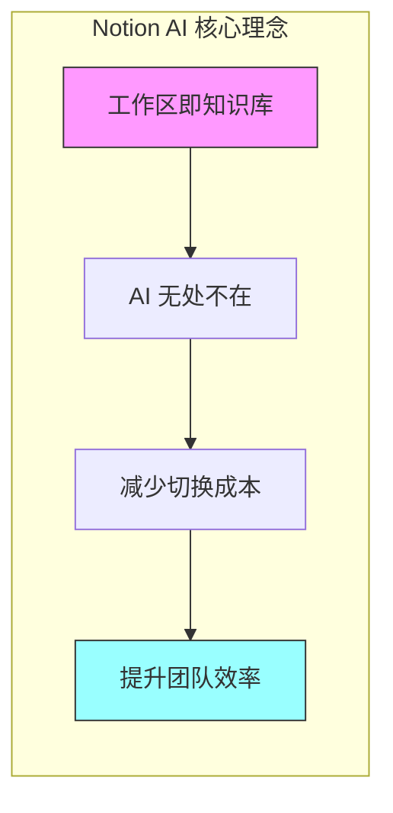
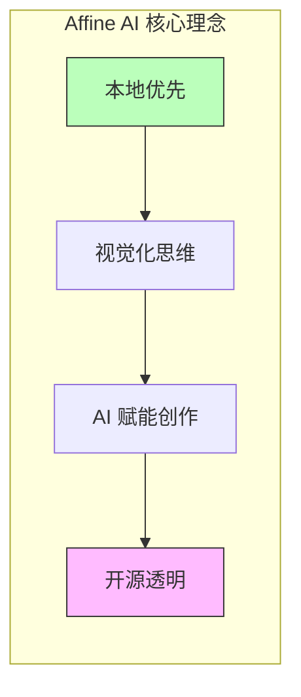
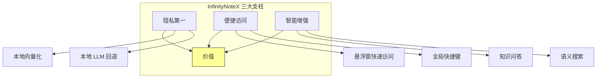
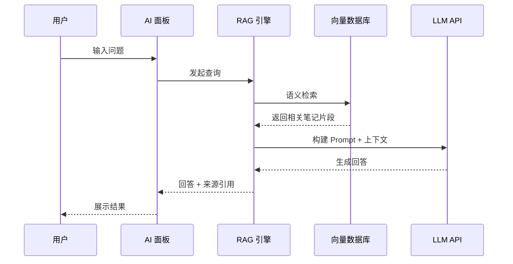
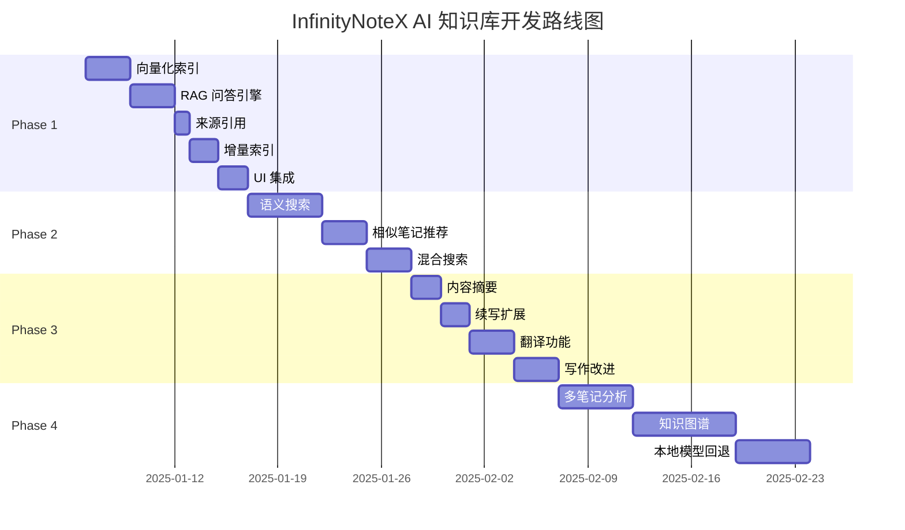

# AI 知识库功能：竞品分析与产品规划报告

**报告日期**: 2025年12月10日\
**版本**: v2.0\
**目标**: 深入分析 Notion AI 和 Affine AI 产品功能，为 InfinityNoteX 制定知识库 AI 功能路线图

---

## 📋 执行摘要

本报告深入研究了两款领先的 AI 知识库产品（Notion AI 和 Affine AI）的功能特性，结合 InfinityNoteX 现有技术架构，提出了一套完整的产品规划方案。报告涵盖：

1. **竞品功能全景图** - Notion AI 和 Affine AI 的完整功能清单
2. **产品思路解析** - 两款产品的设计理念和商业逻辑
3. **我们的产品策略** - InfinityNoteX 的差异化定位和实现路径
4. **亮点功能建议** - 超越竞品的创新功能提案

---

## 🔍 竞品功能全景

### 一、Notion AI 功能清单

#### 🧠 知识库问答（Q&A）

| 功能分类     | 具体功能     | 描述                                 |
| ------------ | ------------ | ------------------------------------ |
| **问答核心** | 工作区问答   | 用自然语言提问，从整个工作区提取答案 |
|              | 来源引用     | 回答附带来源链接，支持追溯验证       |
|              | 权限感知     | 仅从用户有权访问的页面检索信息       |
|              | 选择性知识   | 指定特定页面或来源作为 AI 参考上下文 |
| **多源集成** | Slack 集成   | 从 Slack 消息中检索答案              |
|              | Google Drive | 搜索 Google 文档和文件               |
|              | GitHub/Jira  | 与开发工具集成（2024新增）           |
| **文档分析** | PDF 分析     | 上传 PDF 生成摘要、提问              |
|              | 图片分析     | OCR 提取文本、图片理解               |

#### ✍️ 写作助手

| 功能分类     | 具体功能     | 描述                        |
| ------------ | ------------ | --------------------------- |
| **内容生成** | 头脑风暴     | 生成创意和想法列表          |
|              | 起草内容     | 生成博客、邮件、会议议程等  |
|              | 续写         | 根据上下文继续写作          |
| **内容优化** | 改进写作     | 优化表达，改善文风          |
|              | 缩短/扩展    | 调整内容长度                |
|              | 语气调整     | 改变文章语气（正式/轻松等） |
|              | 修复拼写语法 | 语法纠错                    |
| **内容转换** | 翻译         | 支持多语言互译              |
|              | 摘要生成     | 自动生成长文摘要            |
|              | 简化语言     | 使内容更易理解              |
|              | 解释概念     | 解释专业术语或复杂概念      |

#### 📊 数据库 AI 功能

| 功能分类     | 具体功能        | 描述                                  |
| ------------ | --------------- | ------------------------------------- |
| **自动填充** | AI 摘要属性     | 自动生成页面摘要                      |
|              | 关键词提取      | 自动提取标签/关键词                   |
|              | 自定义 Autofill | 自定义 AI 填充规则（如生成 SEO 描述） |
|              | 截止日期识别    | 从文本智能识别时间                    |
| **批量操作** | 批量翻译        | 一键翻译数据库条目                    |
|              | 批量摘要        | 为多条目生成摘要                      |

#### 🔗 访问方式

- **快捷键**: `Cmd/Ctrl + Shift + K` 全局调用
- **搜索栏**: 输入问题 → 选择 "Ask AI anything"
- **Sparkle 图标**: 页面右下角浮动按钮
- **行内调用**: 选中文本后唤起

---

### 二、Affine AI 功能清单

#### 🎨 Edgeless 白板 AI

| 功能分类       | 具体功能         | 描述                      |
| -------------- | ---------------- | ------------------------- |
| **画布操作**   | 无限画布         | 无边界的创作空间          |
|                | AI 右键菜单      | 选中内容后调用 AI         |
|                | 多模态理解       | GPT Vision 理解图片和形状 |
| **可视化生成** | 思维导图生成     | 从文本一键生成思维导图    |
|                | 演示文稿生成     | 基于内容生成 PPT          |
|                | 图像生成         | 文字描述转图像            |
| **协作功能**   | 实时协作         | 多人同步编辑白板          |
|                | 便签/形状/连接线 | 可视化工具集              |

#### 📄 文档 AI 功能

| 功能分类     | 具体功能      | 描述                   |
| ------------ | ------------- | ---------------------- |
| **写作辅助** | 内容生成      | 生成从句子到文章的内容 |
|              | 重写润色      | 改善文章表达           |
|              | 语气调整      | 切换正式/轻松语气      |
|              | 拼写修复      | 纠正拼写错误           |
| **内容增强** | 内容摘要      | 提炼关键信息           |
|              | 洞察提取      | 分析文档得出见解       |
|              | AI Chat Block | 在文档中嵌入 AI 对话   |

#### 🔗 跨模式集成

| 功能分类     | 具体功能    | 描述                     |
| ------------ | ----------- | ------------------------ |
| **内容联动** | 跨帧嵌入    | 白板内容嵌入文档         |
|              | 同步文档    | 实时同步多个笔记实例     |
|              | Center Peek | 快速预览链接内容         |
| **组织管理** | 反向链接    | 显示引用当前页的其他页面 |
|              | 收藏夹管理  | 改进的收藏组织功能       |
|              | 团队工作区  | 多成员协作空间           |

#### 🏷️ 本地优先特性

- **本地存储**: 数据优先存储在本地
- **离线可用**: 无网络也可正常使用
- **自托管**: 支持私有部署
- **开源**: 核心代码开源

---

## 💡 产品思路对比

### Notion AI 的产品哲学

**关键洞察**:

1. **集成至上** - AI 不是独立功能，而是融入每个交互点
2. **多源聚合** - 将分散的知识（Slack、Google Drive、GitHub）统一检索
3. **信任与透明** - 来源引用建立用户对 AI 输出的信任
4. **降低门槛** - 问答式交互，无需学习复杂操作

**商业逻辑**:

- AI 作为付费增值功能（$10/用户/月）
- 强化团队协作价值，提升粘性
- 数据锁定：越多内容存储在 Notion，切换成本越高

---

### Affine AI 的产品哲学

**关键洞察**:

1. **视觉化优先** - 白板与文档融合，适合创意工作者
2. **隐私至上** - 本地存储、自托管选项，满足敏感数据需求
3. **开源生态** - 社区驱动创新，避免供应商锁定
4. **多模态 AI** - 不仅理解文字，还能理解图像和布局

**商业逻辑**:

- 开源核心 + 付费云服务（团队版）
- 面向开发者和技术团队
- 差异化定位：Notion 的本地优先替代品

---

## 🎯 InfinityNoteX 产品策略

### 差异化定位

| 维度           | Notion AI    | Affine AI      | InfinityNoteX (规划)     |
| -------------- | ------------ | -------------- | ------------------------ |
| **部署**       | 纯云端       | 云+本地        | **纯本地优先**           |
| **数据隐私**   | 中（云存储） | 高（可自托管） | **最高（数据不出设备）** |
| **离线能力**   | 弱           | 强             | **完整离线**             |
| **自定义 LLM** | 不支持       | 有限支持       | **完全支持**             |
| **UI 形态**    | 网页/桌面    | 网页/桌面      | **悬浮窗+固定窗**        |
| **目标用户**   | 团队协作     | 创意工作者     | **个人知识管理**         |

### 核心价值主张

> **"你的私人 AI 知识助手，数据永不离开你的设备"**

---

## 🛠️ 功能实现规划

### Phase 1: 知识问答基础（MVP）

**目标**: 2-3 周内实现基础知识问答

| 功能           | 优先级 | 实现方式                   | 工作量 |
| -------------- | ------ | -------------------------- | ------ |
| 笔记向量化索引 | P0     | sqlite-vec + Embedding API | 3天    |
| 基础问答       | P0     | RAG + 现有 OpenAI Adapter  | 3天    |
| 来源引用       | P0     | 检索结果关联原笔记         | 1天    |
| 增量索引       | P1     | 笔记变更监听器             | 2天    |
| UI 集成        | P1     | AI 面板增加"知识问答"模式  | 2天    |

**技术架构**:

---

### Phase 2: 智能检索（第 4-6 周）

| 功能         | 优先级 | 描述                       |
| ------------ | ------ | -------------------------- |
| 语义搜索     | P0     | 替换现有关键词搜索         |
| 相似笔记推荐 | P1     | 在编辑器侧边栏显示相关笔记 |
| 混合搜索     | P1     | 语义 + 关键词融合排序      |

---

### Phase 3: 写作增强（第 7-10 周）

| 功能      | 优先级 | 描述              |
| --------- | ------ | ----------------- |
| 内容摘要  | P0     | 一键生成笔记摘要  |
| 续写/扩展 | P0     | 光标处继续写作    |
| 翻译      | P1     | 选中文本翻译      |
| 语气调整  | P1     | 正式/轻松语气切换 |
| 改进写作  | P2     | 润色文章表达      |

---

### Phase 4: 高级功能（第 11-16 周）

| 功能           | 优先级 | 描述                   |
| -------------- | ------ | ---------------------- |
| 多笔记综合分析 | P1     | 跨多篇笔记生成报告     |
| 知识图谱可视化 | P2     | 展示笔记间关联关系     |
| 标签智能建议   | P2     | AI 自动推荐标签        |
| 本地模型回退   | P2     | 离线时使用本地嵌入模型 |

---

## ✨ 亮点功能提案

### 1. 🎙️ 语音笔记智能化

> **超越竞品**: Notion/Affine 都不支持语音输入

| 功能       | 描述                   | 技术实现                   |
| ---------- | ---------------------- | -------------------------- |
| 语音转文字 | 录音自动转笔记         | Whisper API / 本地 Whisper |
| 语音问答   | 对笔记提问，语音回答   | TTS API                    |
| 会议摘要   | 录制会议，自动生成摘要 | Whisper + LLM              |

### 2. 🔒 端到端加密知识库

> **超越竞品**: 真正的零知识加密

| 功能     | 描述                 |
| -------- | -------------------- |
| 本地加密 | AES-256 加密所有笔记 |
| 密钥管理 | 用户持有唯一密钥     |
| 加密同步 | 云同步时保持加密状态 |

### 3. 📊 个人知识仪表盘

> **超越竞品**: 量化你的知识积累

| 功能       | 描述                     |
| ---------- | ------------------------ |
| 知识热力图 | 展示笔记创建/编辑频率    |
| 主题分布   | AI 分析笔记主题分布      |
| 知识缺口   | 识别知识体系中的薄弱环节 |
| 复习建议   | 遗忘曲线推荐复习笔记     |

### 4. 🤖 个性化 AI 人格

> **超越竞品**: AI 助手根据你的笔记"了解"你

| 功能     | 描述                     |
| -------- | ------------------------ |
| 风格学习 | 学习用户的写作风格       |
| 偏好记忆 | 记住用户的回答偏好       |
| 主动建议 | 基于历史笔记主动提供见解 |

### 5. 🌐 悬浮窗网页剪藏

> **利用悬浮窗优势**

| 功能     | 描述                         |
| -------- | ---------------------------- |
| 快速剪藏 | 悬浮窗快速保存网页内容       |
| AI 摘要  | 自动生成网页摘要             |
| 关联推荐 | 显示与剪藏内容相关的已有笔记 |

### 6. 🔗 双向链接 + 反向引用

> **对标 Obsidian/Roam**

| 功能         | 描述                          |
| ------------ | ----------------------------- |
| [[双向链接]] | 快速引用其他笔记              |
| 反向引用面板 | 查看引用当前笔记的所有笔记    |
| 未链接引用   | AI 发现语义相关但未链接的内容 |

---

## 📅 实施计划总览

---

## ⚠️ 风险与挑战

### 技术风险

| 风险               | 等级 | 缓解措施                   |
| ------------------ | ---- | -------------------------- |
| sqlite-vec 集成    | 中   | 预研 Electron 原生模块加载 |
| 大量笔记索引性能   | 中   | 后台增量索引、批量处理     |
| Embedding API 成本 | 低   | 本地缓存、仅索引变更部分   |
| 本地模型体积       | 中   | 按需下载、压缩模型         |

### 产品风险

| 风险           | 等级 | 缓解措施                |
| -------------- | ---- | ----------------------- |
| 用户预期过高   | 中   | 明确 MVP 边界，快速迭代 |
| 与编辑体验冲突 | 低   | AI 功能作为可选模块     |
| 隐私担忧       | 低   | 透明说明数据处理方式    |

---

## 📝 总结与建议

### 立即行动

1. **技术验证**: 完成 sqlite-vec 在 Electron 中的集成验证
2. **原型设计**: 设计知识问答的交互流程
3. **用户访谈**: 收集目标用户对知识库功能的需求反馈

### 核心原则

1. **隐私第一**: 所有数据处理都在本地完成
2. **渐进增强**: 从简单问答开始，逐步增加复杂功能
3. **体验一致**: AI 功能与现有编辑器体验无缝融合
4. **灵活配置**: 支持用户自定义 LLM 和嵌入模型

### 成功指标

| 指标         | Phase 1 目标 | 长期目标    |
| ------------ | ------------ | ----------- |
| 问答响应时间 | < 5秒        | < 2秒       |
| 回答相关性   | > 70%        | > 90%       |
| 索引覆盖率   | 100% 笔记    | 100% + 附件 |
| 用户满意度   | > 60%        | > 85%       |

---

**报告生成**: Claude (Antigravity)\
**版本**: v2.0
