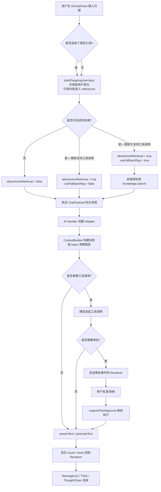
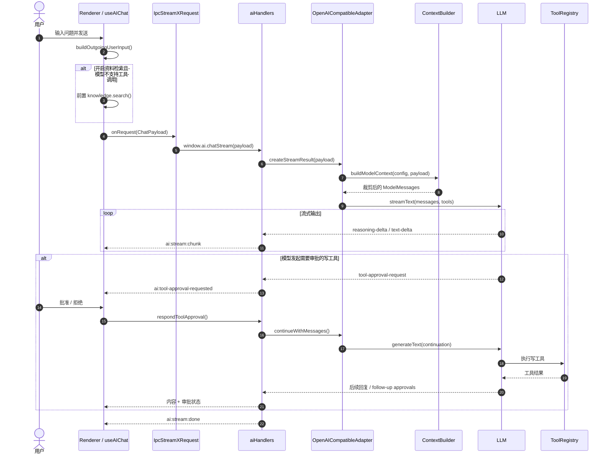

# AI 工作流与 Token 预算

本文档梳理 InfinityNoteX 当前 AI 对话链路，并记录本次收口后的工作流、时序与预算策略。

## 1. 总体工作流



## 2. 主时序图



## 3. 本次发现的问题

1. 便签引用链路存在隐藏旁路。
   之前输入组件会把引用便签正文拼回用户消息本体，导致：
   - 用户气泡和真实请求不一致
   - 上下文被重复注入
   - token 预算被无谓打穿

2. 上下文裁剪过于粗糙。
   之前仅使用固定 `MAX_HISTORY_MESSAGES = 24`，没有考虑：
   - 模型上下文窗口大小
   - `max_tokens` 输出预留
   - 当前问题、引用、RAG、历史之间的竞争关系

3. 检索策略虽然已经收成一条规则，但上下文层仍缺少“预算意识”。
   这会导致在工具检索、手动引用、fallback RAG 并存时，提示词体积膨胀。

## 4. 本次优化

### 4.1 请求组装

- 新增 `buildOutgoingUserInput`
- 用户可见文本保持原样
- 便签内容仅通过 `references` 传递，不再拼回 `message`

### 4.2 统一检索策略

- 知识库按钮现在控制“是否允许 AI 主动检索资料”
- 工具模型：优先走 tool-based retrieval
- 非工具模型：回退到前置 RAG

### 4.3 Token 预算器

新增 `electron/ai/tokenBudget.ts`，把预算拆成：

- `contextWindowTokens`：模型保守上下文窗口
- `responseReserveTokens`：给回答输出预留
- `safetyReserveTokens`：安全余量，避免贴边爆窗
- `currentMessageBudgetTokens`：当前用户问题预算
- `referenceBudgetTokens`：手动引用预算
- `ragBudgetTokens`：RAG 参考资料预算
- `historyBudgetTokens`：历史消息预算

### 4.4 上下文构建

`ContextBuilder` 现在按预算构建：

1. 固定系统提示词
2. 历史消息（从新到旧，按预算回填）
3. 当前检索上下文（RAG / references，按段裁剪）
4. 当前用户消息

其中：

- 历史消息会优先保留最新消息
- 超长历史会被截断，而不是死保固定条数
- 历史里的旧引用会被压缩或退化为纯消息文本
- 当前问题在必要时也会按预算截断，避免直接爆窗

## 5. Token 预算策略

当前预算逻辑是“保守窗口 + 输出预留 + 安全余量 + 分段预算”：

```text
可用输入预算 = 保守上下文窗口 - 输出预留 - 安全余量

其中：
- 输出预留：优先使用用户配置的 max_tokens
- 安全余量：至少 1024 tokens，或窗口的 8%
- 当前问题：优先保证
- 剩余预算再按比例分配给 references / RAG / history
```

### 保守窗口规则

不是直接迷信厂商宣传值，而是使用偏保守的窗口估计：

- 常见明确大窗模型：按 128k 估算
- 主流通用模型族：按 64k 估算
- 未识别自定义模型：按 32k 估算

这样做的目的不是求“理论极限”，而是减少真实运行时的超窗风险。

## 6. 后续建议

### P1

- 把 `ContextBuildDiagnostics` 暴露到开发诊断面板
- 在 AI 设置页显示“估算上下文窗口 / 输入预算 / 输出预留”

### P2

- 对 RAG 结果增加 rerank / minScore 动态裁剪
- 引入长对话摘要记忆，而不是仅靠历史回填

### P3

- 对不同 provider 接入更精确的 tokenizer / context window 元数据
- 从“估算型预算”升级成“provider-aware 预算”
