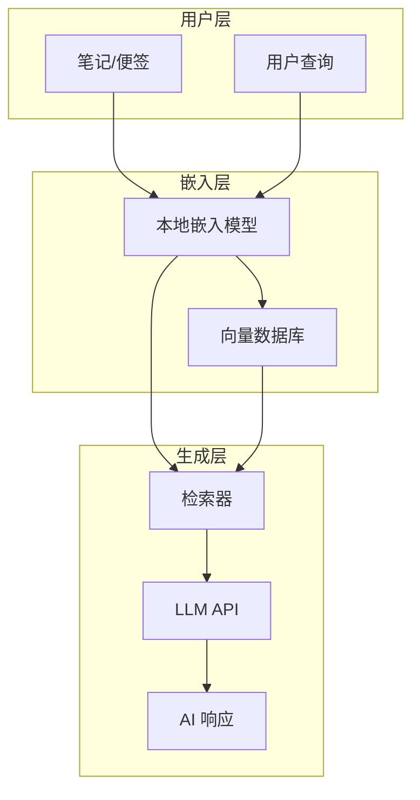

# 知识库功能实现方案研究报告

**报告日期**: 2025年12月7日\
**视角**: 产品经理\
**目标**: 研究如何将现有便签数据升级为类似 Google NotebookLM 或 Notion 知识库的功能

---

## 📋 执行摘要

InfinityNoteX 目前是一款本地优先的便签应用，已具备富文本编辑（TipTap）和基础 AI 对话能力（OpenAI 兼容接口）。本报告研究如何将其升级为具有**智能知识管理**能力的应用，核心目标是让用户能够：

1. **与自己的笔记对话** - 基于笔记内容进行问答
2. **智能检索** - 语义化搜索，而非仅关键词匹配
3. **知识关联** - 自动发现笔记之间的关联关系
4. **内容生成** - 基于现有笔记生成新内容（摘要、大纲、思维导图等）

---

## 🔍 竞品功能分析

### 1. Google NotebookLM

**核心技术**：RAG (Retrieval Augmented Generation) + Gemini LLM

| 功能特性       | 描述                                              |
| -------------- | ------------------------------------------------- |
| 用户定义上下文 | 用户上传文档作为 LLM 的独占上下文                 |
| 减少幻觉       | AI 只能从用户上传的文档中提取信息，不使用通用知识 |
| 来源引用       | 每个回答都附带来源链接，用户可追溯验证            |
| 多格式支持     | Google Docs、PDF、Text、Markdown、URL、YouTube    |
| 即时洞察       | 自动生成 FAQ、时间线、学习指南                    |
| 音频播客       | 将文档转换为音频访谈/播客形式                     |
| RAG-Locked     | 确保回答严格来自用户文档                          |

**优势**：

- 零幻觉设计（grounded responses）
- 无需编码即可使用
- 企业级安全合规

**劣势**：

- 依赖 Google 云服务
- 数据需上传到 Google

---

### 2. Notion AI 知识库

**核心技术**：向量嵌入 (Vector Embeddings) + RAG

| 功能特性   | 描述                                   |
| ---------- | -------------------------------------- |
| 语义搜索   | 理解查询含义，而非仅匹配关键词         |
| 工作区问答 | 用自然语言提问，从整个工作区中提取答案 |
| 内容摘要   | 自动摘要页面、提取多条目洞察           |
| 内容生成   | 生成备忘录、简报等新内容               |
| 知识关联   | 跨页面关联信息                         |

**技术实现**：

- 使用 OpenAI 零保留嵌入 API 生成向量
- 存储在专用向量数据库 (Turbopuffer)
- RAG 流程：查询 → 检索相关上下文 → 生成响应

**优势**：

- 与现有笔记系统深度集成
- 用户数据留在 Notion 生态内

**劣势**：

- 需付费订阅
- 依赖云服务

---

## 🏗️ 技术架构方案

基于 InfinityNoteX 的**本地优先**定位，推荐采用**本地 RAG 架构**：



### 核心组件选型

#### 1. 向量数据库选型

| 方案           | 优势                                 | 劣势                         | 推荐度     |
| -------------- | ------------------------------------ | ---------------------------- | ---------- |
| **sqlite-vec** | 轻量级、与现有 SQLite 集成、MIT 开源 | 功能相对简单                 | ⭐⭐⭐⭐⭐ |
| Chroma         | 功能丰富、内置嵌入                   | 额外依赖、较重               | ⭐⭐⭐⭐   |
| Faiss          | 高性能、Meta 出品                    | 仅是库非数据库、需额外持久化 | ⭐⭐⭐     |

> [!TIP]
> **推荐 sqlite-vec**：与项目现有的本地文件存储策略一致，可直接存储在用户数据目录，无需额外服务。

#### 2. 嵌入模型选型

| 方案                            | 优势                 | 劣势                 | 使用场景 |
| ------------------------------- | -------------------- | -------------------- | -------- |
| **远程 API** (OpenAI, 火山引擎) | 高质量、无需本地资源 | 需网络、有成本       | 默认方案 |
| 本地模型 (all-MiniLM-L6-v2)     | 离线可用、免费       | 需下载模型、占用资源 | 离线模式 |

> [!NOTE]
> 建议采用**混合策略**：在线时使用远程 API（如当前已配置的 OpenAI 兼容接口），离线时回退到本地小模型。

#### 3. LLM 层

项目已具备 `OpenAICompatibleAdapter`，可继续使用现有配置：

- 支持任何 OpenAI 兼容接口
- 支持流式响应
- 已有完整的配置管理

---

## 🎯 功能规划（产品视角）

### Phase 1: 基础知识库（MVP）

**目标**：让用户能与笔记对话

| 功能     | 描述                         | 优先级 |
| -------- | ---------------------------- | ------ |
| 笔记索引 | 自动将所有笔记转换为向量嵌入 | P0     |
| 简单问答 | 选择笔记后进行问答           | P0     |
| 来源引用 | 展示回答引用的笔记来源       | P0     |
| 增量更新 | 笔记修改后自动更新索引       | P1     |

**用户场景**：

> 用户选择一个或多个笔记，然后在 AI 面板中提问："这些笔记的主要观点是什么？"，AI 基于笔记内容生成回答并标注来源。

### Phase 2: 智能检索

**目标**：语义化搜索替代关键词搜索

| 功能     | 描述                                   | 优先级 |
| -------- | -------------------------------------- | ------ |
| 语义搜索 | 输入"关于项目管理的笔记"能找到相关笔记 | P0     |
| 相似笔记 | 查看当前笔记的相关笔记                 | P1     |
| 搜索增强 | 混合语义搜索 + 关键词搜索              | P1     |

### Phase 3: 知识增强

**目标**：智能内容生成与发现

| 功能     | 描述                     | 优先级 |
| -------- | ------------------------ | ------ |
| 自动摘要 | 一键生成笔记摘要         | P0     |
| 大纲生成 | 从多篇笔记生成结构化大纲 | P1     |
| 知识图谱 | 可视化笔记关联关系       | P2     |
| 智能标签 | 自动建议笔记标签         | P2     |

### Phase 4: 高级功能（对标 NotebookLM）

| 功能     | 描述                     | 优先级 |
| -------- | ------------------------ | ------ |
| 多源输入 | 支持导入 PDF、网页、音频 | P1     |
| 播客生成 | 将笔记转换为音频对话     | P2     |
| 协作问答 | 多人共享知识库           | P3     |

---

## 🔧 技术实现路径

### 现有基础

根据项目代码分析，已具备：

```
✅ 数据存储层
   - NoteStorage: 便签 CRUD
   - AIStorage: AI 对话持久化
   - 完整的 Schema 定义 (Zod)

✅ AI 调用能力
   - OpenAICompatibleAdapter: 支持任何 OpenAI 兼容接口
   - 流式响应支持
   - 配置管理

✅ 前端 AI 面板
   - ChatEditor: 对话界面
   - ConversationList: 对话列表
```

### 需新增模块

```
📦 新增：向量存储模块
   - electron/storage/VectorStorage.ts
   - 使用 sqlite-vec 扩展
   - 存储: 笔记 ID ↔ 向量嵌入

📦 新增：嵌入服务
   - electron/embedding/index.ts
   - 调用远程 embedding API
   - 回退到本地模型

📦 新增：RAG 引擎
   - electron/rag/RAGEngine.ts
   - 检索相关笔记
   - 构建增强 prompt
   - 调用 LLM 生成回答

📦 新增：索引管理器
   - electron/indexer/NoteIndexer.ts
   - 笔记变更监听
   - 增量索引更新
```

### 数据流设计

```
用户创建/修改笔记
       ↓
NoteStorage.create/update
       ↓
  触发索引事件
       ↓
 NoteIndexer 监听
       ↓
 调用 EmbeddingService
       ↓
 存储到 VectorStorage
       ↓
    索引完成

用户提问
       ↓
 RAGEngine.query
       ↓
 1. 查询转向量
 2. VectorStorage 相似度检索
 3. 获取相关笔记内容
 4. 构建 RAG Prompt
 5. 调用 LLM
       ↓
 返回带引用的回答
```

---

## 📊 工作量估算

| 阶段    | 模块                       | 预估工时 | 难度 |
| ------- | -------------------------- | -------- | ---- |
| Phase 1 | VectorStorage (sqlite-vec) | 2-3天    | 中   |
| Phase 1 | EmbeddingService           | 1-2天    | 中   |
| Phase 1 | RAGEngine 基础版           | 2-3天    | 中   |
| Phase 1 | 前端 UI 改造               | 2-3天    | 低   |
| Phase 2 | 语义搜索集成               | 2天      | 中   |
| Phase 2 | 相似笔记推荐               | 1天      | 低   |
| Phase 3 | 自动摘要/大纲              | 2天      | 低   |
| Phase 3 | 知识图谱可视化             | 5天      | 高   |

**总计 Phase 1 MVP**: 约 **7-11 天**

---

## ⚠️ 风险与挑战

### 技术风险

| 风险                          | 等级 | 缓解措施                 |
| ----------------------------- | ---- | ------------------------ |
| sqlite-vec 在 Electron 中集成 | 中   | 预研原生模块加载方案     |
| 大量笔记时索引性能            | 中   | 采用增量索引、后台处理   |
| embedding API 成本            | 低   | 本地缓存向量、仅索引变更 |

### 产品风险

| 风险               | 等级 | 缓解措施               |
| ------------------ | ---- | ---------------------- |
| 用户预期过高       | 中   | 明确功能边界，逐步迭代 |
| 与现有编辑体验冲突 | 低   | 知识库功能作为独立模块 |

---

## 🎯 差异化定位

相比 NotebookLM 和 Notion AI，InfinityNoteX 知识库的差异化优势：

| 特性       | NotebookLM | Notion AI | InfinityNoteX (规划) |
| ---------- | ---------- | --------- | -------------------- |
| 本地优先   | ❌         | ❌        | ✅                   |
| 离线可用   | ❌         | ❌        | ✅ (本地模型回退)    |
| 数据隐私   | 中         | 中        | ✅ 数据不出设备      |
| 自定义 LLM | ❌         | ❌        | ✅                   |
| 悬浮窗体验 | ❌         | ❌        | ✅                   |
| 开源       | ❌         | ❌        | ✅ (可能)            |

---

## 📝 结论与建议

### 推荐路线

1. **短期 (1-2周)**：完成 Phase 1 MVP
   - sqlite-vec 集成
   - 基础 RAG 问答
   - 来源引用展示
2. **中期 (1个月)**：Phase 2 语义搜索
   - 替换现有关键词搜索
   - 相似笔记推荐
3. **长期 (2-3个月)**：Phase 3-4 完整知识库
   - 知识图谱
   - 多源导入
   - 高级生成功能

### 立即行动

1. **技术预研**：验证 sqlite-vec 在 Electron 中的可行性
2. **原型设计**：设计知识问答的 UI 交互
3. **API 调研**：确认 embedding API 的选择（建议使用与现有 AI 配置相同的接口）

---

**报告生成**: Claude (Antigravity)\
**版本**: v1.0
